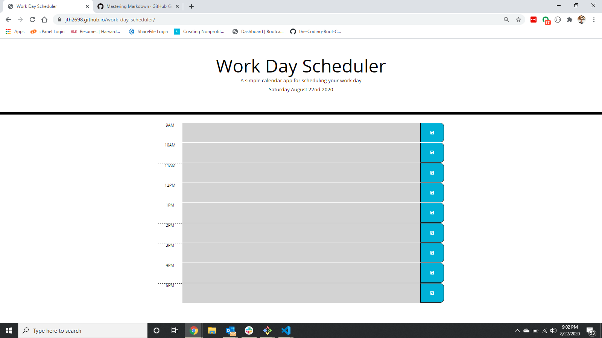

# Work Day Scheduler

A simple calendar application that allows the user to save events for each hour of the day. This app runs in the browser and features dynamically updated HTML and CSS powered by jQuery.

## Deployed Application and Screenshot

https://jth2698.github.io/work-day-scheduler/

## Build Overview

This app relies heavily on jQuery to dynamically generate all elements on the page

* first, the script.js file pulls the current day and time from the moment.js api and displays at the top of the page
* then, the js targets the index.html calendar container and generates the calender with three timeBlock elements - hourEl, descriptionEl, and the saveBtn
* NOTE, that the jQuery assigns a dataTime data-attribute to the hourEls and descriptionEls. this will come in handy for our class assignment and localStorage functions.
* with the calander container populated, we target all timeBlocks and assign .past, .current, and .future classes depending on the relative position of moment.js currentHour to the dataTime of each element
* then we populate the descriptionEls with any data in localStorage to ensure that all descriptions remain on page refresh
* finally we apply an .on ("click") function to each saveBtn to ensure that all new description values are saved into localStorage.

## Final Thoughts

Not too hard. Enjoy the app dear user!